<div align="right">
  <a href="README.md"></a>
  <a href="README.vi.md"></a>
</div>

# 📰 Topic Classification - Vietnamese Text Classifier

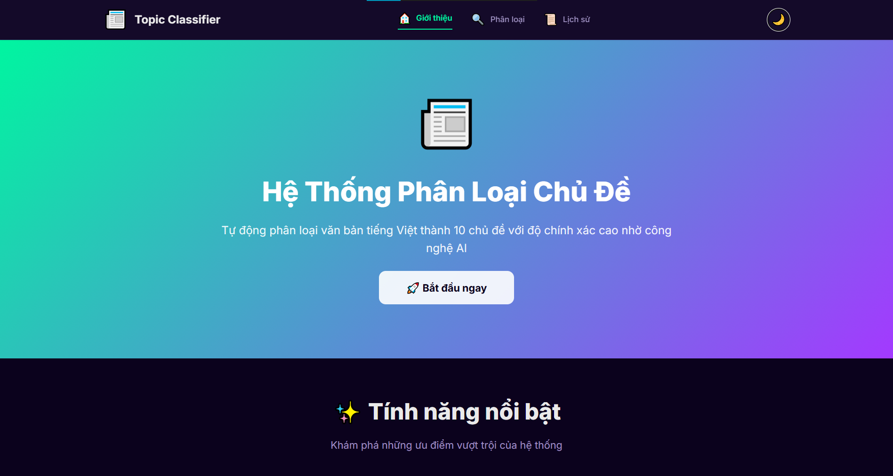


<div align="center">


</div>

---
<a id="introduction"></a>
## 📖 Introduction

**Topic Classification** is an AI-powered web application that automatically classifies Vietnamese text into **10 predefined topics** with high accuracy (85-92%). Built using **Naive Bayes** algorithm and **TF-IDF** vectorization, the system efficiently organizes news articles, social media posts, and various text content.

**Key Highlights:**
- 🎯 **10 Topics:** Sports, Economy, Entertainment, Technology, Education, Health, Law, News, Science, Culture
- ⚡ **Real-time:** Classification results in seconds
- 💾 **History:** Save and review past classifications
- 🌓 **Dark Mode:** Modern UI with light/dark theme
- 📱 **Responsive:** Optimized for desktop, tablet, and mobile

**Live Demo:**
- Frontend (Netlify): https://leotran-topic-classification.netlify.app/
- Frontend (Vercel): https://topic-classification.vercel.app/pages/classify.html
- Backend (Render): https://leotran-topic-classification.onrender.com (auto-sleep on free tier, may take ~30-60s to wake)

---

## 📑 Table of Contents

<!-- - [Introduction](#-introduction)
- [About the Author](#-about-the-author)
- [Technology Stack](#-technology-stack)
- [Key Features](#-key-features)
- [Installation & Setup](#-installation--setup)
- [Usage](#-usage)
- [Project Structure](#-project-structure)
- [Model Details](#-model-details)
- [Demo Screenshots](#-demo-screenshots)
- [API Documentation](#-api-documentation)
- [Roadmap](#-roadmap)
- [License](#-license)
- [References](#-references) -->


- [Introduction](#introduction)
- [About the Author](#about-the-author)
- [Technology Stack](#technology-stack)
- [Key Features](#key-features)
- [Installation & Setup](#installation-setup)
- [Usage](#usage)
- [Project Structure](#project-structure)
- [Model Details](#model-details)
- [Demo Screenshots](#demo-screenshots)
- [API Documentation](#api-documentation)
- [Roadmap](#roadmap)
- [License](#license)
- [References](#references)
- [Contact](#contact)


---
<a id="about-the-author"></a>
## 👨‍💻 About the Author

The project is developed and maintained by:

| Avatar | Information | Contact |
| :---: | :--- | :--- |
|  | **Phạm Minh Phương** | [](https://github.com/TranDucLong040904)<br>[](mailto:22010139@st.phenikaa-uni.edu.vn) |
---
<a id="technology-stack"></a>
## 🛠️ Technology Stack

<details>
<summary><b>Click to view technology details</b></summary>

### Backend
| Component | Technology | Version |
|-----------|------------|---------|
| **Framework** |  | `3.0.0` |
| **ML Library** |  | `1.3.2` |
| **Language** |  | `3.11` |
| **Algorithm** | **Multinomial Naive Bayes + TF-IDF** | - |
| **Additional** |   | - |

### Frontend
| Component | Technology | Version |
|-----------|------------|---------|
| **CSS Framework** |  | `3.4` |
| **Chart Library** |  | `4.4` |
| **Icons** |  | - |
| **Languages** |    | - |
| **Storage** |  | - |


### Development Tools
-  Version control
-  Code editor
-  Data exploration & model training

</details>

---
<a id="key-features"></a>
## 🚀 Key Features

### For End Users
* ✅ **Text Classification:** Instant topic prediction for Vietnamese text
* ✅ **Visual Results:** Donut chart and progress bars with confidence scores
* ✅ **History Management:** 
  - Auto-save classification results
  - Filter by topic
  - Delete single or multiple records
  - Click to reload previous results
* ✅ **Dark Mode:** Toggle between light/dark themes (persists across pages)
* ✅ **Responsive Design:** Seamless experience on all devices

### For Developers
* ✅ **RESTful API:** Easy integration with external applications
* ✅ **Pre-trained Model:** Ready-to-use classifier
* ✅ **Expandable Dataset:** Simple data addition process
* ✅ **Modular Code:** Clean separation of backend/frontend

---
<a id="installation-setup"></a>
## ⚙️ Installation & Setup

### System Requirements
```bash
Python   >= 3.11
pip      >= 23.0
Git      >= 2.40
```

### Quick Start

```bash
# 1. Clone repository
git clone https://github.com/Phuong04082004/Topic_Classification
cd topic-classification

# 2. Create virtual environment
python -m venv venv

# 3. Activate virtual environment
# Windows: 
venv\Scripts\activate
# macOS/Linux:
source venv/bin/activate

# 4. Install dependencies
cd backend
pip install -r requirements.txt

# 5. Run backend API (local dev)
python app.py
# ✅ Backend runs at:  http://localhost:5000 (prod: https://leotran-topic-classification.onrender.com)
```

### Launch Frontend

**Option 1: Open built site (recommended)**
```text
https://leotran-topic-classification.netlify.app/
```

**Option 2: Local server for frontend**
```bash
cd frontend
python -m http.server 8000
# ✅ Visit: http://localhost:8000/index.html (Classify at /pages/classify.html, History at /pages/history.html)
```

---
<a id="usage"></a>
## 📖 Usage

<details>
<summary><b>1. Text Classification - Click to expand</b></summary>

<br>

```
Step 1: Navigate to "Classify" page
Step 2: Enter Vietnamese text (minimum 10 characters)
Step 3: Click "Classify" button
Step 4: View results: 
        • Main topic with confidence score
        • Top 5 topics (donut chart)
        • Detailed breakdown (progress bars)
```

</details>

<details>
<summary><b>2. History Management - Click to expand</b></summary>

<br>

```
View History:     Go to "History" page
Filter:           Select topic from dropdown
Select Multiple:  Check boxes → Click "Delete"
Reload Result:    Click on any history item
```

</details>

<details>
<summary><b>3. Theme Toggle - Click to expand</b></summary>

<br>

```
Toggle:         Click ☀️/🌙 icon in navbar
Auto-save:      Theme persists across pages and sessions
```

</details>

---
<a id="project-structure"></a>
## 📂 Project Structure

<details>
<summary><b>Click to view folder structure</b></summary>

<br>

```
Topic Classification
├── 📁 backend
│   ├── 📁 data
│   │   └── 📄 improved_dataset.csv
│   ├── 📁 models
│   │   ├── 📄 topic_classifier.pkl
│   │   └── 📄 vectorizer.pkl
│   ├── 🐍 app.py
│   ├── 🐍 create_improved_dataset.py
│   ├── 📄 requirements.txt
│   ├── 🐍 test_api.py
│   └── 🐍 train_model.py
├── 📁 frontend
│   ├── 📁 css
│   │   ├── 🎨 classify.css
│   │   ├── 🎨 history.css
│   │   ├── 🎨 home.css
│   │   └── 🎨 shared.css
│   ├── 📁 js
│   │   ├── 📄 classify.js
│   │   ├── 📄 history.js
│   │   ├── 📄 navbar.js
│   │   └── 📄 theme.js
│   ├── 📁 libs
│   ├── 📁 pages
│   │   ├── 🌐 classify.html
│   │   ├── 🌐 history.html
│   └── 📄 config.js
│   └── 🌐 index.html
├── ⚙️ .gitignore
└── 📝 README.md
```

</details>

---
<a id="model-details"></a>
## 📊 Model Performance Evaluation

<div align="left">

| 🎯 Accuracy | 🎯 Precision | 🎯 Recall | 🎯 F1-Score |
| :---: | :---: | :---: | :---: |
|  |  |  |  |

</div>

<br>

<details>
<summary><b>⚙️ View Configuration & Detailed Breakdown</b></summary>


### 🧠 Algorithm & Training Configuration
> **Core Algorithm:** `Multinomial Naive Bayes` with `TF-IDF Vectorization`

| Parameter | Value | Description |
| :--- | :--- | :--- |
| 📚 **Dataset Size** | `2,000` samples | Balanced (200/topic) |
| ✂️ **Split Ratio** | `80/20` | Train/Test split |
| 🔠 **TF-IDF Features** | `5,000` | Max vocabulary size |
| 🔗 **N-gram Range** | `(1, 2)` | Unigrams + Bigrams |
| 🧩 **Smoothing** | `alpha=1.0` | Laplace smoothing |
| 🎲 **Random State** | `42` | Reproducibility |

<br>

### 📈 Per-Topic Performance Analysis
*Visual representation of F1-Scores across all topics (Sorted by Performance).*

| Topic | Precision | Recall | F1-Score | Performance Rating |
| :--- | :---: | :---: | :---: | :--- |
| **Sports** (Thể thao) | 95% | 92% | **93%** |  |
| **Technology** (Công nghệ) | 91% | 89% | **90%** |  |
| **News** (Thời sự) | 90% | 88% | **89%** |  |
| **Economy** (Kinh tế) | 90% | 88% | **89%** |  |
| **Science** (Khoa học) | 89% | 87% | **88%** |  |
| **Health** (Sức khỏe) | 88% | 86% | **87%** |  |
| **Entertainment** (Giải trí) | 87% | 85% | **86%** |  |
| **Culture** (Văn hóa) | 87% | 85% | **86%** |  |
| **Law** (Pháp luật) | 86% | 84% | **85%** |  |
| **Education** (Giáo dục) | 85% | 83% | **84%** |  |

</details>

---
<a id="demo-screenshots"></a>
## 🖼️ Demo Screenshots

<details>
<summary><b>🏠 Home Page - Click to expand</b></summary>

<br>

**Landing Page (Light Mode):**

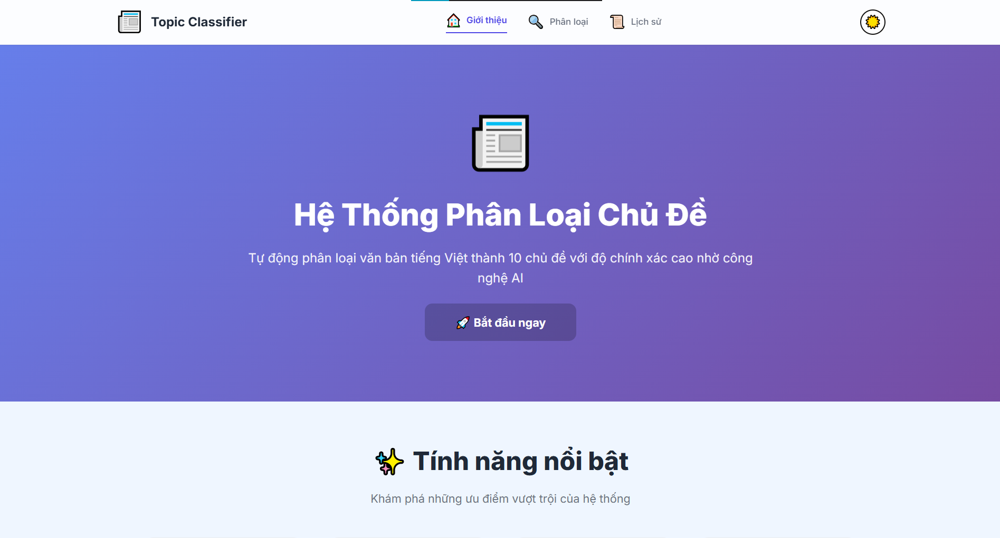

**Landing Page (Dark Mode):**

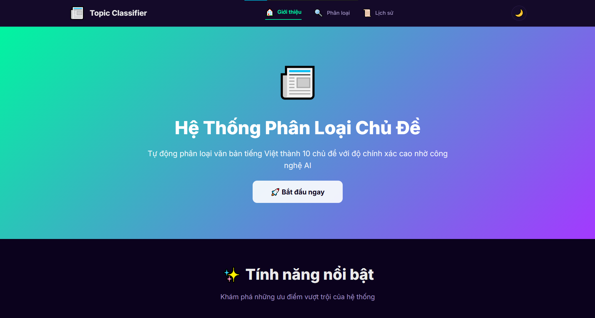

**Features Section:**

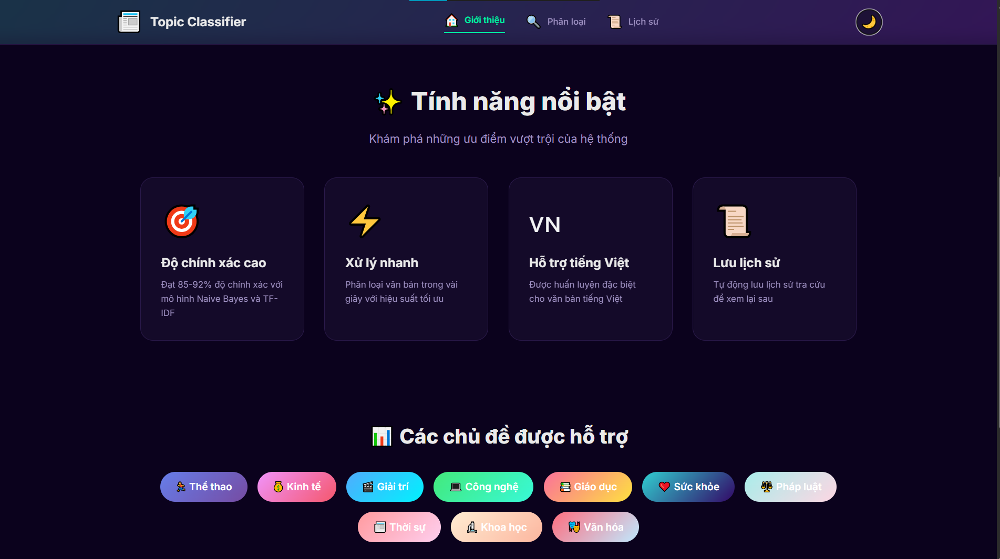

</details>

<details>
<summary><b>🔍 Classification Page - Click to expand</b></summary>

<br>

**Input Interface:**

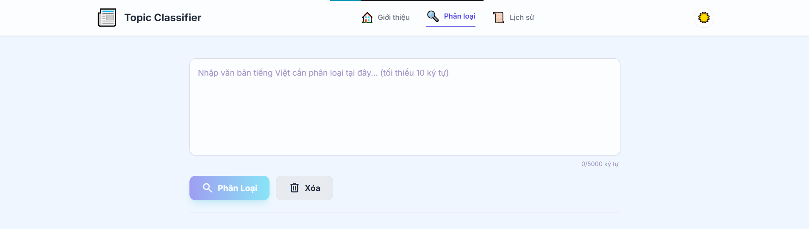
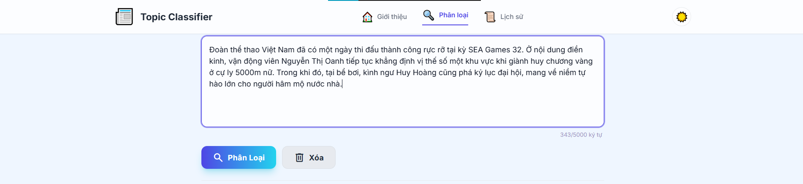

**Results Display:**

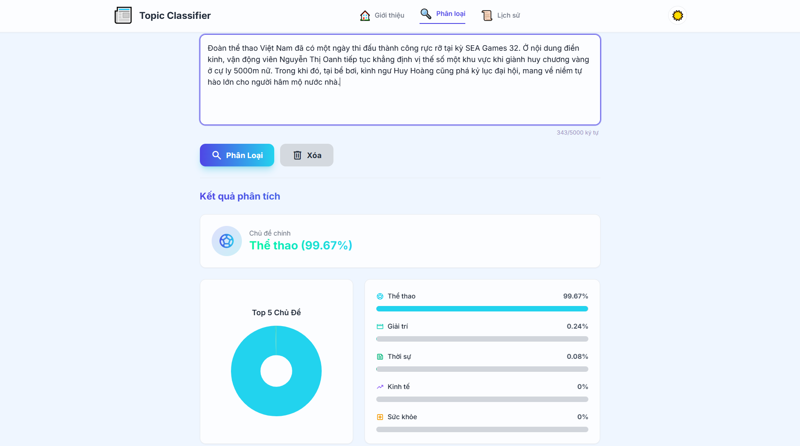

**Mobile View:**


</details>

<details>
<summary><b>📜 History Page - Click to expand</b></summary>

<br>

**History List:**

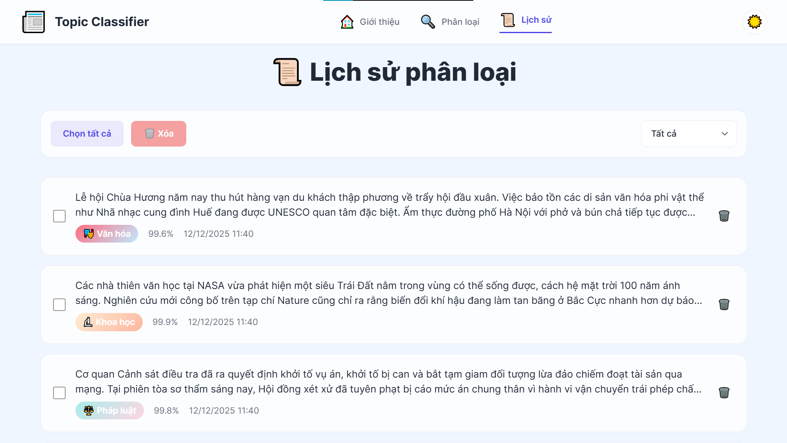

**Filter & Actions:**

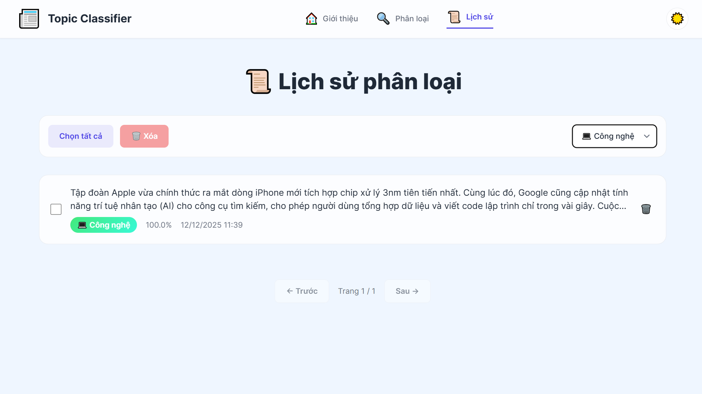

**Empty State:**

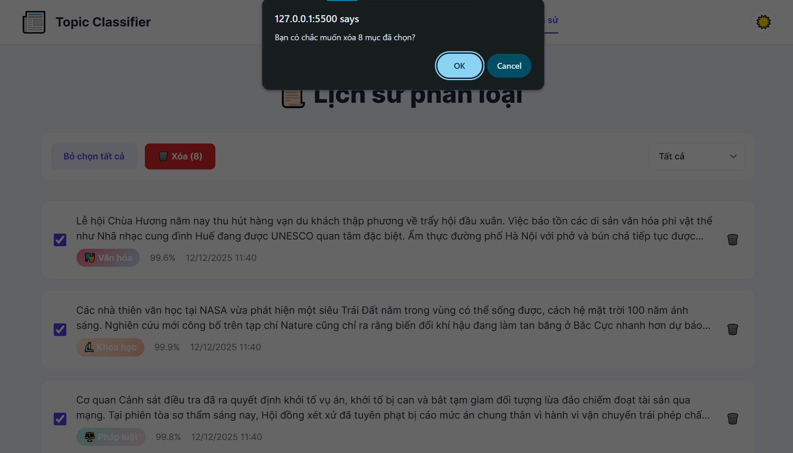
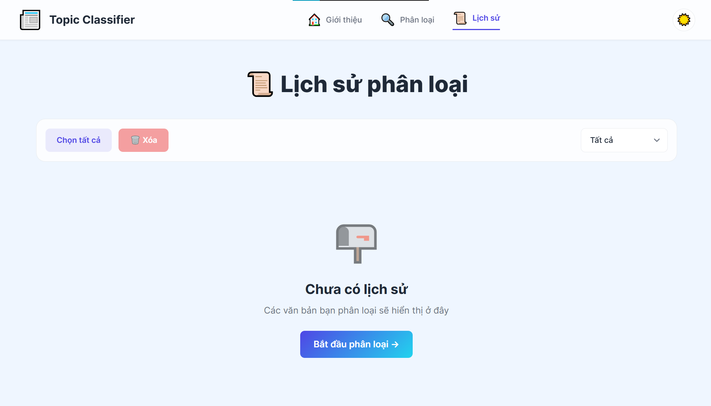
</details>

---
<a id="api-documentation"></a>
## 📡 API Documentation

<details>
<summary><b>API Endpoints - Click to expand</b></summary>


### Base URL
```
Production: https://leotran-topic-classification.onrender.com
Local:      http://localhost:5000
```

### 1. Health Check

**Endpoint:**
```http
GET /
```

**Response:**
```html
<h1>📰 Topic Classification API</h1>
<p>✅ API is running</p>
```

---

### 2. Classify Text

**Endpoint:**
```http
POST /predict
```

**Request Headers:**
```http
Content-Type: application/json
```

**Request Body:**
```json
{
  "text": "Đội tuyển Việt Nam giành chiến thắng 3-0 trong trận chung kết AFF Cup"
}
```

**Response (Success - 200):**
```json
{
  "status": "success",
  "top_topic": "Thể thao",
  "predictions": [
    {"topic": "Thể thao", "probability": 95.2},
    {"topic": "Văn hóa", "probability":  2.1},
    {"topic": "Thời sự", "probability": 1.5},
    {"topic": "Giải trí", "probability": 0.8},
    {"topic": "Kinh tế", "probability": 0.4}
  ]
}
```

**Response (Error - 400):**
```json
{
  "status": "error",
  "message": "Text is required"
}
```

---

### Usage Examples

**cURL:**
```bash
curl -X POST http://localhost:5000/predict \
  -H "Content-Type: application/json" \
  -d '{"text":"Vietnamese stock market rises sharply today"}'
```

**Python:**
```python
import requests

response = requests.post(
    'http://localhost:5000/predict',
    json={'text': 'Vietnamese stock market rises sharply today'}
)

data = response.json()
print(f"Topic: {data['top_topic']}")
print(f"Confidence: {data['predictions'][0]['probability']}%")
```

**JavaScript (Fetch API):**
```javascript
fetch('http://localhost:5000/predict', {
  method:  'POST',
  headers:  {'Content-Type': 'application/json'},
  body: JSON.stringify({
    text: 'Vietnamese stock market rises sharply today'
  })
})
.then(res => res.json())
.then(data => {
  console.log('Topic:', data.top_topic);
  console.log('Confidence:', data.predictions[0].probability + '%');
});
```

</details>

---
<a id="roadmap"></a>
## 🗺️ Roadmap

<details>
<summary><b>Development Phases - Click to expand</b></summary>

### Phase 1-6: ✅ Completed
- [x] Environment setup
- [x] Backend API development
- [x] Frontend development
- [x] Model training with dataset
- [x] UI/UX improvements
- [x] Testing & debugging

### Phase 7: 🔄 In Progress
- [x] Documentation (README)
- [ ] Production deployment
- [ ] Technical report

### Phase 8: 📅 Planned
- [ ] Deploy Backend to Render
- [ ] Deploy Frontend to Vercel
- [ ] Custom domain configuration
- [ ] Performance optimization
- [ ] Expand training dataset
- [ ] Improve model accuracy (target 92%+)
- [ ] Add export functionality (CSV/PDF)
- [ ] API rate limiting
- [ ] User authentication (optional)
- [ ] Multi-language support

</details>

---
<a id="license"></a>
## 📜 License

```
Copyright © 2026 Phạm Minh Phương

This project is shared for EDUCATIONAL and REFERENCE purposes only. 

✅ Allowed: 
   • View and study the source code
   • Clone for personal learning and research
   • Contribute via pull requests

❌ Not Allowed: 
   • Commercial use without permission
   • Resale or redistribution
   • Claim as your own work

All intellectual property rights belong to the author.
```

---
<a id="references"></a>
## 🔗 References

### Official Documentation
- [Flask Documentation](https://flask.palletsprojects.com/)
- [Scikit-learn User Guide](https://scikit-learn.org/stable/user_guide.html)
- [Tailwind CSS Docs](https://tailwindcss.com/docs)
- [Chart.js Documentation](https://www.chartjs.org/docs/)
- [Material Symbols Guide](https://fonts.google.com/icons)

### Datasets & Models
- [Hugging Face Vietnamese Dataset](https://huggingface.co/)
- [Vietnamese NLP Resources](https://github.com/undertheseanlp)


---
<a id="contact"></a>
## ☎️ Contact
- **GitHub:** [Pham Minh Phuong](https://github.com/Phuong04082004)
- **Email:** 22010243@st.phenikaa-uni.edu.vn
- **Project Repository:** [Topic Classification](https://github.com/Phuong04082004/Topic_Classification)
<div align="center">

---
**⭐ If you find this project helpful, please give it a star! ⭐**

---
<br>

Made with ❤️ by **Pham Minh Phuong**

Copyright © 2026 • [MIT License](#-license)

**[⬆ Back to top](#-topic-classification---vietnamese-text-classifier)**

</div>
